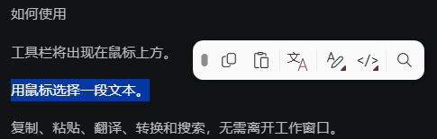

# IKnowText

一个 Windows 划词工具栏：选中文本即出现，可复制、翻译、文本转换、编码/解码、网页搜索。
基于 [SnapActions](https://github.com/roko-tech/SnapActions) v2.4.5 的**独立中文改造版** —— 界面与外观中文化、翻译改用百度翻译 API（**不依赖 WebView2**）、新增自定义 JS 脚本动作与自定义翻译引擎；上游的浏览器扩展伴侣已移除，选区改由 Windows UI Automation 读取。

A Windows selection toolbar that appears when you select text — an independent, Chinese-localised build of SnapActions v2.4.5 (Baidu Translate instead of Google + WebView2, plus user-defined JavaScript actions).

仓库 <https://github.com/XuejiMeixiangli/IKnowText> · 详细文档：[用户指南](docs/user-guide.md)




1. 下载发布包，解压到固定位置 —— 单文件自包含（`LICENSE` 与 `licenses\` 是许可文件，分发时请一起带走），免安装、不需要 WebView2
2. 运行 `IKnowText.exe`（需要管理员权限：动作要向其它程序注入按键）
3. 选中任意文本 → 工具栏出现 → 点动作；结果弹层可「复制结果」，选区可编辑时还能「替换选区」
4. 单击托盘图标打开设置。**在线功能默认关闭**（翻译等），先在设置里开启「允许在线查找」

## 主要特性

- **划词工具栏**：悬停预览结果；拖动固定、右键取消固定、齿轮编辑模式（左键显示/隐藏动作）、4 列自适应子菜单
- **文本动作**：文本转换（大小写 / 排序 / 去重 / 包裹 …）、编码解码（URL / Base64 / HTML / Hex / 哈希）、计算、颜色 / 单位 / 时区 / JWT、链接清理、文本转换方案
- **翻译**：百度翻译开放平台（凭据经 Windows DPAPI 加密）；也可用 JS 自写**自定义翻译引擎**替换（入口 `Translate(text)`，与用户脚本动作的 `JSAction(text)` 分开）
- **自定义 JS 脚本动作**：Jint 沙箱里的 `JSAction(text)`，支持「上下文触发」正则；勾选「允许此脚本访问网络」后脚本可以**发送并接收 HTTP 请求**
- **触发与托盘**：划词即显示、按 `Ctrl+C` 显示、排除应用清单；托盘含 5 组动作开关 / 开机自启 / 设置 / 退出

> ⚠️ **自定义 JS 脚本能联网，请谨慎对待**：勾选「允许此脚本访问网络」后，脚本可用 `await http.get(url, options)` / `await http.post(url, body, options)` **发送请求并读取响应**，请求目标与内容完全由脚本决定。
> **不要把密码、密钥、令牌等敏感信息交给脚本上传；也不要运行来源不明或未审阅过的脚本。** 沙箱能挡住文件与剪贴板访问、并限制执行时长与响应大小，但挡不住脚本主动把你的数据发到它指定的地址。

## 系统要求

- 64 位 Windows 10 / Windows 11
- 发布包自包含（无需安装 .NET 运行时），无安装器

## 从源码构建

需要 .NET SDK **10.0.400**（`global.json` 锁定）；完整打包另需 Python 3.11+。

```bat
git clone https://github.com/XuejiMeixiangli/IKnowText.git

:: 构建
dotnet build SnapActions\SnapActions.csproj -c Release

:: 单元测试（-warnaserror）
dotnet test SnapActions.Tests\SnapActions.Tests.csproj -c Release

:: 快速发布单文件
SnapActions\publish.bat

:: 完整打包 + 校验（ZIP 与校验和落在 artifacts\）
SnapActions\build.bat
```

## 文档

| 文档 | 内容 |
| --- | --- |
| [用户指南](docs/user-guide.md) | 动作与检测类型、使用与自定义、翻译与在线查询、自定义 JS 脚本动作、设置项、隐私、工作原理、构建与 CI |
| [发布说明](docs/releases) | 各版本变更 |
| [LICENSE](LICENSE) | MIT；原版权归 [roko-tech](https://github.com/roko-tech)，改造部分归本仓库作者 |

**数据目录**：`%APPDATA%\IKnowText` —— `settings.json`（含加密后的凭据）、`scripts\`（脚本源码）、`logs\`（按天日志，保留 7 天）。首次启动时会自动从改名前的 `%APPDATA%\SnapActions` 迁移设置与脚本，旧目录保留不删。用环境变量 `IKNOWTEXT_DATA_DIR` 可指向其它目录，用于多实例或隔离自测。

## English

**IKnowText** is a Windows selection toolbar with a Chinese UI, based on SnapActions v2.4.5: select text and a toolbar appears with copy, translate, transform, encode/decode and search actions.

- Baidu Translate API instead of Google + WebView2; credentials encrypted with Windows DPAPI
- Custom JavaScript actions — `JSAction(text)` in a Jint sandbox with an optional context-trigger regex — plus custom translation engines (entry point `Translate(text)`, separate from `JSAction(text)`). With 允许此脚本访问网络 (allow network) ticked, a script can **send requests and read the responses** via `await http.get/post(...)`
- Tray: five action-group toggles, auto-start, settings, exit. Online features are off by default
- Self-contained single-file release: no .NET install, no WebView2, 64-bit Windows 10/11. Keep `LICENSE` and `licenses\` together with the executable when you redistribute it
- Build: .NET SDK 10.0.400, `dotnet build SnapActions\SnapActions.csproj -c Release`; full gate: `SnapActions\build.bat`
- Docs: [user guide](docs/user-guide.md) · data lives in `%APPDATA%\IKnowText` (override with `IKNOWTEXT_DATA_DIR`) · MIT

> ⚠️ **Scripts can reach the network — treat them accordingly.** A script with network access ticked can send HTTP requests and read the responses, to whatever endpoint it names. **Never paste secrets (passwords, API keys, tokens) into a script, and do not run scripts you have not read or do not trust.** The sandbox blocks file and clipboard access and caps runtime and response size, but it cannot stop a script from uploading what you give it.

## Acknowledgements

Based on [SnapActions](https://github.com/roko-tech/SnapActions) v2.4.5, copyright (c) 2026 [roko-tech](https://github.com/roko-tech).

The SnapActions project is maintained by [rokogan](https://github.com/rokogan); original commits authored by M. AL-hejji. This repository is an independent Chinese-localised build with additional features — see [LICENSE](LICENSE) for the copyright of both the upstream project and this repository's modifications.

