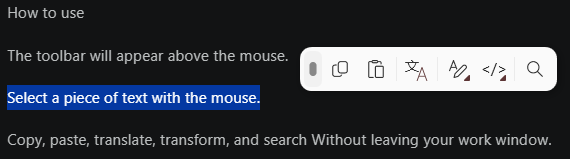

# IKnowText user guide

[Back to the overview](../README.md)



This reference covers everyday actions, settings, compatibility and development. The interface is in Chinese: on-screen labels are quoted as they appear, with an English gloss where it helps.

- [Use the toolbar](#use)
- [Supported text and actions](#what-it-detects)
- [Inline lookups](#inline-popups)
- [Customize and configure](#customize)
- [JavaScript script actions](#javascript-script-actions)
- [Privacy](#privacy)
- [Capture behavior and compatibility](#how-it-works)
- [Build and test](#build-from-source)

## Use

Select text anywhere — drag-select, double-click a word, triple-click a line. A floating toolbar appears above the cursor with actions tailored to what you picked.

```
Select  youtube.com                   →  Open URL, clean tracking links, search
Select  2+3*4                         →  Calculate (= 14)
Select  5 ft                          →  Convert (1.524 m | 60 in | 1.667 yd | …)
Select  #89B4FA                       →  Preview color (with swatch), cycle to rgb/hsl
Select  eyJhbGciOiJI...               →  Decode JWT header/payload
Select  {"a":1,"b":2}                 →  Format / Minify JSON
Select  a sentence                    →  Translate, Search
```

**Hover any toolbar button to see the result before clicking.** Preview text is computed only for pure actions — local transforms, encoders, formatting, calculation, color/unit/time conversion and link cleaning, on selections up to 4 KB — and for search engines, which preview the query they would open. Color hovers show a live swatch alongside the text.

Clicking an action that produces text opens a result popup with **复制结果** (Copy result) and **替换原文** (Replace original). Copy revalidates the captured selection before it writes to the clipboard. Replace snapshots the clipboard, re-checks that the original target is still focused, and injects a paste over the selection; a busy clipboard, a moved focus or an uncertain target cancels the replacement and leaves a retry available. The source excerpt stays beside the result, and when the target application refuses a replacement, **Copy result** still completes the job.

Automatic highlight capture is clipboard-free and is on by default. Selections are read from the focused element's accessibility tree, with a Chromium geometry fallback for same-line drags; only when that yields no selection at all does IKnowText fall back to a synthetic Ctrl+Insert copy, restoring the previous clipboard afterwards. For unsupported surfaces, turn on **按 Ctrl+C 时显示工具栏** (Show the toolbar when I press Ctrl+C) and copy explicitly to summon the toolbar there.

To bring up a paste menu without an existing selection, **long-press** the left mouse button (500 ms by default) inside any text input. The **粘贴为** (Paste as) menu applies transforms and encoders to the clipboard text and pastes the result back. The trigger itself is a setting (`pasteModeTrigger`: long-press, double-click on an empty editable field, or off) that the Settings window does not currently expose.

Mixed Arabic/English hover previews use the selection's text direction when available, with the selected phrase displayed separately from the English search label. Long previews trim within the popup. Leaving a toolbar action closes its hover-only popup; an open action menu stays available. This affects display only; copied text stays unchanged.

## What it detects

| Type | Example | Actions |
|---|---|---|
| URL | `youtube.com`, `www.example.com`, `https://example.com`, `ftp://files.example.com` | Open, clean tracking links |
| Email | `user@example.com` | Send via mailto |
| File path | `C:\folder\file.txt`, `\\server\share\file` | Open file, reveal in Explorer |
| JSON | `{"key":"val"}`, `[1, 2, 3]` | Format, minify |
| XML/HTML | `<div>text</div>` | Format, strip tags |
| Math | `2+3*4`, `sqrt(16)`, `pi*2` | Calculate |
| IP address | `192.168.1.1`, `2001:db8::1` | Lookup |
| Color | `#89B4FA`, `rgba(255, 0, 0, 0.5)`, `rgb(255 0 0 / 50%)`, `hsl(120, 50%, 50%)` | Preview, cycle hex/rgb/hsl with alpha preserved |
| UUID | `550e8400-e29b-41d4-a716-446655440000` | Generate new |
| Base64 | `SGVsbG8gV29ybGQh` | Decode |
| Date/Time | `2026-04-11T12:00:00+05:00`, Unix timestamps | Convert (Local / UTC / Unix) |
| Currency | `$33`, `100 SAR`, `€1,500.50`, `€1.500,50` | Convert to the target currency — USD by default (handles American & European number formats) |
| JWT | `eyJhbGciOiJI...`, including `alg=none` unsigned tokens | Decode header / payload / signature |
| Unit | `5 ft`, `100 km/h`, `5 fl oz`, `20°C`, `2 cups` | Convert to all common units |

Bare domains can include a path, port, query or fragment. **Open URL** adds `https://` when the selection has no scheme.

XML formatting rejects DTD declarations and limits input to 32,768 characters and formatted output to 65,536 characters, including indentation.

Detection runs entirely in-process, without network calls.

## Inline popups

Translate and Currency Converter show their results inside IKnowText. The first time an action needs a third-party service, IKnowText asks for permission before anything leaves the machine; you can change that afterwards with **允许在线查找（翻译）** (Allow online lookups) under Settings → 通用 → 工具栏行为.

**翻译 (Translate)** sends the selected text to the Baidu Translate open-platform API (`nmt` model) and shows the returned plain text in a IKnowText popup. It never opens a browser tab, an embedded browser or a web view.

- Fill in the Baidu **APP ID** and **密钥** (secret) under Settings → 翻译 → 百度翻译. They auto-save, are encrypted with Windows DPAPI for the current user, and translation reports a configuration error until both are present.
- Translate is offered only for plain-text selections — URLs, JSON, UUIDs, JWTs and other typed values do not get the action. On the Baidu path the selection is limited to **2000 UTF-8 bytes** (bytes, not characters); with a custom translation engine selected that byte cap no longer applies, because the engine decides what it can handle.
- The popup's source dropdown starts at 检测语言 (detect language) and its target at your Windows display language. When the text is already in the Windows display language, the target falls back to the language configured as 源语言为 Windows 系统语言时翻译输出的语言 (English by default) so the text is not echoed back untranslated. Changing either dropdown in the popup re-runs the translation and saves that language for the next selection.
- 内容忽略正则表达式 (Settings → 翻译) deletes everything matching the pattern before the text is sent, and English identifiers are lightly normalized (`camelCase` → `camel Case`, `snake_case` → `snake case`) so they translate as words.
- **复制结果** copies the translation, **替换原文** injects it over the selection through the same guarded replace path as other results, **重新翻译** retries, the bottom-right grip resizes the popup, and the close button dismisses it. The toolbar does not auto-dismiss while the popup is open; Esc closes the popup without hiding the toolbar.

**自定义翻译** (Settings → 翻译 → 自定义翻译) replaces Baidu with JavaScript engines you write — see [JavaScript script actions](#javascript-script-actions). Pick one as 默认引擎 and both the built-in Translate action and any script's `await Translation(text, from, to)` run it; 百度翻译 in that list means "no custom engine". Engines always run in the network sandbox and read the current languages from `SNAP_SOURCE_LANGUAGE` / `SNAP_TARGET_LANGUAGE`.

**货币转换 (Currency Converter)** converts one selected amount to the target currency — USD by default — using exchange rates from open.er-api.com, cached for 6 hours per source currency. Only the rate request for the source currency is sent; the amount stays local.

Currency popups stay open until you press **Esc**, click the **X**, successfully copy, click outside or trigger another lookup. They do not dismiss when the cursor leaves. A timeout or a service failure shows the error with a **重试** (Retry) button and offers nothing to copy as a result.

## Transforms

UPPERCASE · lowercase · Title Case (locale-invariant) · camelCase · PascalCase · snake_case · kebab-case · Reverse (grapheme-aware — emoji and combining marks survive) · Trim · Remove Extra Spaces · Remove Line Breaks · Sort Lines · Remove Duplicates (case-insensitive) · Wrap in quotes / brackets / braces / backticks / Chinese quotes 「」

## Encode / Decode

URL · Base64 · HTML · Hex · ROT13 · MD5 / SHA-1 / SHA-256 / SHA-512 (under Encode; MD5/SHA-1 are checksum-only — never security)

## Search

4 built-in engines — Google, Bing, BiliBili and GitHub — all enabled by default; toggle them under Settings → 动作 → 启用搜索.

- **Custom engines** via URL templates: `{0}` is the URL-encoded query. Add a name and URL under Settings → 动作 → 添加自定义搜索 and delete custom engines again from the same list.
- Both built-in and custom engines hand the query to your default browser; IKnowText itself never makes the request.

## Customize

- **Pin** an action: drag it from any submenu onto the toolbar. A blue insertion line shows where it will land. You can also right-click → 固定到工具栏 (Pin to toolbar).
- **Unpin**: right-click the pinned button → 从工具栏取消固定.
- **Hide or show**: open a submenu's gear to enter edit mode, then left-click an action to toggle it. Hidden actions stay listed with a strikethrough, and edit mode keeps the submenu open while you work through it.
- **Reorder** pins: drag a pin onto the left or right half of another pin, or right-click → 左移 / 右移.
- **Submenus**: actions are laid out in a 4-column adaptive grid. With 悬停展开子窗口 (open submenus on hover) on, the 文本转换 (Transform) and 编码/解码 (Encode) submenus open on hover.
- **Paste** uses the toolbar's 粘贴 button, which pastes the clipboard into the current target.
- **Per-app exclusions**: Settings → 应用 — one process name per line, with **添加正在运行的应用程序...** (Add running app) to pick from running processes. No toolbar appears while an excluded app is in the foreground.
- **Settings**: click the tray icon to open it (the tray menu's 更多设置 opens it too). Changes auto-save and refresh the current toolbar immediately.

| Setting | Options | Default |
|---|---|---|
| 主题 Theme | 跟随系统设置 / 浅色 / 深色 (System / Light / Dark) | System |
| 启用工具栏 Enable toolbar | On / Off | On |
| 开机自启 Start with Windows | On / Off | Off |
| 划词即复制 Copy on selection | On / Off | Off |
| 悬停展开子窗口 Open submenus on hover | On / Off | Off |
| 按 Ctrl+C 时显示工具栏 Show toolbar on Ctrl+C | On / Off | Off |
| 允许发送合成键 Allow synthetic keys | On / Off | On |
| 允许在线查找（翻译） Allow online lookups | On / Off | Off — asks on first use |
| 显示延迟 Toolbar show delay | 立即 (instant), 100 ms – 1 s | 立即 |
| 多点单击显示延迟 Multi-click delay | 立即, 100 – 400 ms | 200 ms |
| 自动关闭时间 Auto-dismiss after | 3 / 5 / 8 / 15 / 30 s, 从不 (never) | 8 s |
| 最大显示建议动作的数量 Suggested actions on toolbar | 1 / 2 / 3 / 4 / 6 / 8 (the rest fall into 更多操作) | 8 |
| 固定在工具栏的动作 Pinned actions | Any action; reorder by drag or right-click | None |
| 启用动作 Action groups | 粘贴 / 翻译 / 文本转换 / 编码解码 / 网页搜索 | All on |
| 启用搜索 Search engines | Google, Bing, BiliBili, GitHub and custom engines | All built-ins on |
| 翻译项 → 源语言 Translation source | 检测语言 / Windows 显示语言 / supported languages | 检测语言 (detect) |
| 翻译项 → 目标语言 Translation target | Windows 显示语言 / supported languages | Windows 显示语言 |
| 翻译项 → 源语言为 Windows 系统语言时的输出 | Supported languages | English |
| 翻译项 → 内容忽略正则表达式 Translation ignore regex | Any regular expression | Empty |
| 百度翻译 APP ID / 密钥 Baidu credentials | — | Empty — translation reports a configuration error until set |
| 自定义翻译 → 默认引擎 Translation engine | 百度翻译 or an added engine | 百度翻译 (no custom engine) |
| 文本转换方案 Text recipes | Up to 12 pure steps per recipe | None |
| JS 脚本动作 Script actions | Name + `JSAction(text)` script | None |
| JS 脚本动作 → 上下文触发 Context trigger | Regular expression | Empty — the action never joins the context row |
| JS 脚本动作 → 允许此脚本访问网络 Allow network | On / Off, per script | Off |
| 排除的应用程序 Excluded apps | Process names, one per line | PotPlayerMini64, PotPlayerMini |
| 目标货币 Target currency | Edited in settings.json | USD |

Settings live at `%AppData%\IKnowText\settings.json`. Writes are crash-safe (serialize to `settings.json.tmp`, then atomic rename) so a process crash mid-write can't blank the file; the write is not fsync'd, so a hard power loss between the rename and the disk flush can still resurrect the previous file content. If the file gets corrupted on load it's renamed to `settings.json.broken-<timestamp>` and defaults are used — never silent data loss. The 5 most recent backups are kept.

A few behaviors have no Settings control and are edited in `settings.json`: the paste-mode trigger (`pasteModeTrigger`, default `longpress`), the long-press duration (`longPressDuration`, 500 ms), automatic mouse-selection capture (`captureOnMouseSelection`, on), clipboard restoration after a copy (`restoreClipboardAfterAction`, off), the global search-language filter (`searchLanguage`, empty = no filter) and the per-engine language flag (`useLanguageFilter`).

Logs go to `%AppData%\IKnowText\logs\YYYY-MM-DD.log`, capped at 10 MB per file (older content rotates to `.1`, `.2`, …) with files older than 7 days pruned at most once every 24 hours of process uptime.

## Local tools and customization

- **Clean tracking link:** previews removal of known tracking parameters while preserving remaining query bytes, duplicates and fragments. It removes `utm_*`, `fbclid`, `gclid`, `dclid`, `msclkid`, `mc_cid`, `mc_eid`, `igshid`, `_hsenc` and `_hsmi`; it does not remove generic parameters such as `ref` or `token`.
- **Saved text recipes:** Settings → 自定义 → 文本转换方案 → 创建方案. Add, reorder or remove up to 12 existing pure text operations and preview sample text. Save once, then use the recipe from the 文本转换 submenu or pin it like any other action. Intermediates never touch the clipboard; oversized output or a failed step cancels the result.
- **Settings:** the window has five pages (通用 / 动作 / 翻译 / 自定义 / 应用) with an autosave status line. A failed save keeps the window open with **重试保存** (Retry save).

## JavaScript script actions

Settings → 自定义 → JS 脚本动作 → 添加脚本动作 adds your own text action. Each script defines a global `JSAction(text)`: the selection is passed in and the return value is the result text (a string is used verbatim; arrays and plain objects are serialized as JSON). The action is a Transform action, so it appears in the 文本转换 submenu and can be pinned and reordered like any built-in one.

- **Sandbox:** scripts run in a Jint sandbox with CLR interop disabled — no file, network or clipboard access by default. One run is limited to **2 seconds**, **50,000 statements**, **16 MB** of memory and **128K characters** of output.
- **Storage:** the source is written to `%APPDATA%\IKnowText\scripts\{Id}.js` and `settings.json` keeps only the file name, so you can edit the `.js` file with your own editor and the next run picks it up.
- **上下文触发 (context trigger):** an optional regular expression. When it matches the current selection, the script action is also pushed inline into the toolbar's context row (next to Calculate or Format JSON) while remaining available in the 文本转换 submenu. An empty, invalid or pathologically slow pattern simply never matches — a badly backtracking pattern is abandoned after 200 ms rather than delaying the toolbar.
- **允许此脚本访问网络 (allow this script network access):** per script, off by default. When it is on, the sandbox additionally receives `await http.get(url, options)` / `await http.post(url, body, options)` (returning `{status, ok, headers, body}`) and `await Translation(text, from, to)` (which runs the translation engine selected under 设置 → 翻译 → 自定义翻译). Turning it on asks for the online-lookup consent once. Requests must be absolute http/https URLs; loopback, link-local, `.local` and private-range hosts are refused; a single request is capped at 8 seconds and 256 KB of response body; a run may make at most 5 requests within a 20-second network budget and 30 seconds overall; redirects are not followed and Windows credentials are never attached.
- **Testing:** the editor runs the script against a sample text as you type and shows the sandbox's `console.log` output. Networked scripts debounce that live preview, issue real requests and need the consent gate; the scripts themselves write nothing to your clipboard or files.

> ⚠️ **A script with network access sends and receives requests.** Only tick 允许此脚本访问网络 for scripts you have read and trust, and never hand a script secrets (passwords, API keys, tokens) to upload. The sandbox blocks file and clipboard access and caps runtime and response size, but it cannot stop a deliberate request to an endpoint the script chooses.

Examples:

```js
// Reuse the translation engine picked under 设置 → 翻译 → 自定义翻译.
// Tick 允许此脚本访问网络 in the editor first.
async function JSAction(text) {
  return await Translation(text, 'en', 'zh');
}
```

```js
// A custom translation engine: call any API and return the translated text. Engines always run
// in the network sandbox and read the current languages from the globals.
async function JSAction(text) {
  var resp = await http.post(
    'https://api.example.com/translate',
    JSON.stringify({ q: text, from: SNAP_SOURCE_LANGUAGE, to: SNAP_TARGET_LANGUAGE }),
    { headers: { 'Content-Type': 'application/json' } });
  if (!resp.ok) throw new Error('HTTP ' + resp.status);
  return JSON.parse(resp.body).result;
}
```

## Privacy

- **Detection is local.** All detectors run in-process. No network calls for detection.
- **Online actions are opt-in.** Translate sends the selection and chosen languages to the Baidu Translate API (fanyi-api.baidu.com). Currency requests exchange rates for the source currency from open.er-api.com; the selected amount stays local. A script action you opted into network access, and a custom translation engine you selected, make whatever requests their script defines. All of it runs over HTTPS, only after you allow online lookups, and declining a prompt sends nothing.
- **Credentials are encrypted at rest.** The Baidu AppID and secret are protected with Windows DPAPI for the current user before they are written to `settings.json`.
- **Browser-handoff actions.** IP Lookup (ipinfo.io) opens a URL containing your selection in your default browser; IKnowText itself never makes the request. Web search engines work the same way.
- **Everything else stays local.** Format/minify, transform, encode/decode, hash, color/unit/timezone/JWT/Base64 — none of these touch the network.
- **Excluded apps.** No toolbar appears while an excluded process is in the foreground; the defaults add PotPlayerMini64 and PotPlayerMini, and you can add your own under Settings → 应用.
- **Risky-extension prompt.** Opening files with code-bearing extensions (`.exe`, `.bat`, `.ps1`, `.iso`, `.docm`, `.lnk`, …) requires explicit confirmation. Without this, a malicious selection like `C:\Users\you\Downloads\invoice.exe` could be one click away from running.
- **UNC path prompt.** Opening `\\server\share\…` paths prompts before contacting the remote host. Without the prompt, opening a UNC path on an attacker-controlled network could initiate an SMB connection that leaks your Windows NTLM hash to the named server.
- **No IKnowText telemetry.** The desktop app has no analytics, automatic updater or account. Online providers have their own behavior and policies.

## How it works

**Dedicated mouse-hook thread.** The low-level Windows mouse hook runs on its own STA background thread with its own dispatcher. UI thread work — WPF rendering, GC, layout — never delays mouse callbacks. Selection debounce uses `Environment.TickCount64` so NTP sync, hibernation resume, or manual clock changes never spuriously suppress or re-fire the hook.

**Automatic text capture is clipboard-free.** Mouse drag, double-click, and triple-click selection use `TextPattern.GetSelection` through the accessibility tree. IKnowText walks up to 6 parents of the focused element and also checks the element under the cursor. For Chromium, same-line drags reconstruct characters from their on-screen geometry and map visual bidi runs back to logical text order; double-click reconstructs the clicked word and requires the same UTF-16 length as the provider selection. This workaround has limits around mixed-direction content. Automatic capture never sends a copy message: only when the tree yields no selection at all does IKnowText fall back to a synthetic Ctrl+Insert keystroke, then restores the previous clipboard.

UI Automation coverage is not universal. Java Swing, some browser/Electron contexts, and custom text renderers may expose no selected text, so the automatic toolbar cannot appear there without a copy operation. A Chromium gesture fails closed when its geometry cannot be mapped safely (including cross-line bidi drags), when its range extends outside the provider's document, or when a double-click word cannot confirm the provider-reported selection length. Enable **按 Ctrl+C 时显示工具栏** for those cases: your physical copy supplies the exact text, and IKnowText validates and reads the resulting clipboard value.

**Clipboard behavior is explicit.** Automatic highlighting never touches it. A physical Ctrl+C changes it because you requested a copy. Native result previews close after a successful explicit copy; `restoreClipboardAfterAction` (off by default, edited in `settings.json`) can put the prior contents back after about 3 seconds. The translation popup's **复制结果** button copies the translation and leaves the popup open.

**Replacement targets are revalidated, not assumed.** A replace captures the clipboard, re-checks the original target's window identity and the captured selection, and only then injects the paste; the target application still decides whether it accepts the text. A caret or control type alone never authorizes an edit.

**Per-monitor DPI throughout.** Toolbar positioning, hit-testing, and the sub-menu popup each look up the DPI of the monitor they're rendering on, including when the popup spills onto a different-DPI monitor than the toolbar.

**Guarded synthetic input.** Every path that injects input back into the user's app — long-press paste mode, Paste, and replacing a selection with a result — carries the original target's foreground and focused HWND, process/thread, and available UIA identity. It rechecks that identity and the captured selection before committing input. These checks reject observed target changes; Windows does not provide an atomic transaction covering another application's selection and subsequent keyboard input.

**When the toolbar appears (and when it doesn't).** Mouse-up after a drag, double/triple-click, or long-press *can* trigger the toolbar — but several gates have to agree before it shows. In order:

1. **NCHITTEST gate** (gesture-fire time) — gestures that started on a window's title bar, resize border, or native scrollbar are dropped. The hook can't tell those drags from a text-selection drag at the OS level, so we ask the receiving window via `WM_NCHITTEST` — deferred to fire time so only candidate selection gestures (not every click system-wide) pay the cross-process round-trip.
2. **Scrollbar-edge heuristic** (mouse-up) — a drag with both endpoints within ~25 px of the right (or left, in RTL layouts) edge AND primarily vertical is treated as a custom-scrollbar drag (Chrome, VS Code, Slack, Electron apps). Same with bottom edge + horizontal motion.
3. **Cursor-shape gate** (mouse-down + mouse-up) — the OS shows the text (I-beam) cursor over selectable text, a more universal signal than UIA TextPattern. I-beam at either point permits capture. A *hard* non-text cursor (resize, crosshair, wait, no-drop, …) at both points — resizing a window, a busy app, dragging a slider — is dropped before UIA work. Arrow, link-hand, custom, and unreadable cursors remain eligible because browsers and custom controls can display them over real selectable text.
4. **Excluded-app + self-PID checks** — anything in your Settings → 应用 list never sees a toolbar, and clicks on IKnowText's own toolbar are ignored.
5. **Selection read** — IKnowText checks the focused element's accessibility tree and then the element under the cursor; if neither yields text, the synthetic Ctrl+Insert fallback can still supply it. A known non-text item stops capture. Empty or unavailable data produces no toolbar.

If a suppression case is misbehaving in your app, check the log file (`%AppData%\IKnowText\logs\YYYY-MM-DD.log`) — every gate that fires writes a line with the cursor position and reason. As an escape hatch, add the app's process name to **Settings → 应用**.

## Build from source

```bash
git clone https://github.com/XuejiMeixiangli/IKnowText.git
cd IKnowText
dotnet build SnapActions/SnapActions.csproj -c Release
dotnet test SnapActions.Tests/SnapActions.Tests.csproj
```

Build a complete verified package (Windows, .NET SDK 10.0.400 as pinned by `global.json`, and Python 3.11+):

```powershell
python tools/package.py
```

`SnapActions/build.bat` runs the same command. Each run writes a fresh directory under `artifacts`: a self-contained single-file executable, a ZIP, SHA-256 checksums, test receipts, and compiled WPF renders of the settings pages, tray menu, toolbar and editors. It never replaces an existing installation. NuGet dependencies are restored in locked mode and `global.json` pins the SDK. `SnapActions/publish.bat` is the shortcut for a plain single-file publish without the verification steps.

For isolated manual testing, set `IKONWTEXT_DATA_DIR` to an **absolute path** before starting the executable. Settings, logs and mutex then use that separate instance. Startup registration is disabled for isolated instances. `--self-test` requires this override and runs without global hooks or clipboard writes.

## Tests & CI

The xUnit suite covers detection and selection geometry (including multiline and bidi mapping), transforms and encoders, unit/color/math conversion, the Baidu client and credential storage, capture policy and selection validation, clipboard/operation safety, JS script execution (sandbox results, console capture, context triggers and the network bridge), toolbar pinning/visibility preferences, search URL templates, and lookup/fetch response handling.

CI runs the complete [package gate](../tools/package.py), which restores packages in locked mode, runs the xUnit suite with warnings treated as errors, publishes the self-contained executable, runs its `--self-test` (compiled WPF layout/state checks and renders, reported as a JSON receipt) against an isolated data directory, and writes the ZIP plus SHA-256 checksums. See [the workflow](../.github/workflows/build.yml) and [CI runs](https://github.com/XuejiMeixiangli/IKnowText/actions/workflows/build.yml). Automated checks and compiled renders do not certify every live interaction.

## Architecture

Selection events create an operation generation tied to the original target. `SelectionCoordinator` reads the selection through UI Automation and returns an immutable `SelectionSnapshot`. The registry matches actions and the toolbar presents them; `ActionRunner` coordinates explicit effects, `ClipboardTransaction` owns native snapshots and rollback, and `InputExecutor` owns guarded paste/replace input. When UI Automation yields no selection, capture falls back to a synthetic Ctrl+Insert copy and restores the previous clipboard.

`LookupService` owns currency/custom-fetch HTTP response budgets, provider parsing and successful exchange-rate caching. `ResultPopup` owns their loading/success/empty/error/cancelled presentation and stale-retry suppression. `BaiduTranslator` owns the Baidu request signing and response parsing, `TranslationEngineService` runs the selected JS translation engine, and the toolbar's own translation popup renders both without a web view. `JsScriptRunner` hosts the Jint sandbox (`ScriptHttpBridge` backs opted-in network access) and `ScriptActionStorage` keeps script sources as `scripts\{Id}.js` files. Settings parsing normalizes semantic data before migrations; test instances have explicit runtime paths.

Capture diagnostics are recorded for the log: timings separate event-time target identification, dispatcher queue, UIA reads, validation, classification, action matching and render-ready latency. Busy/timeout counters expose the cost of unavailable UIA providers. Render-ready excludes physical screen paint; these measurements are not a blanket performance claim. A hung UIA worker retains the single-flight gate to prevent thread accumulation.
